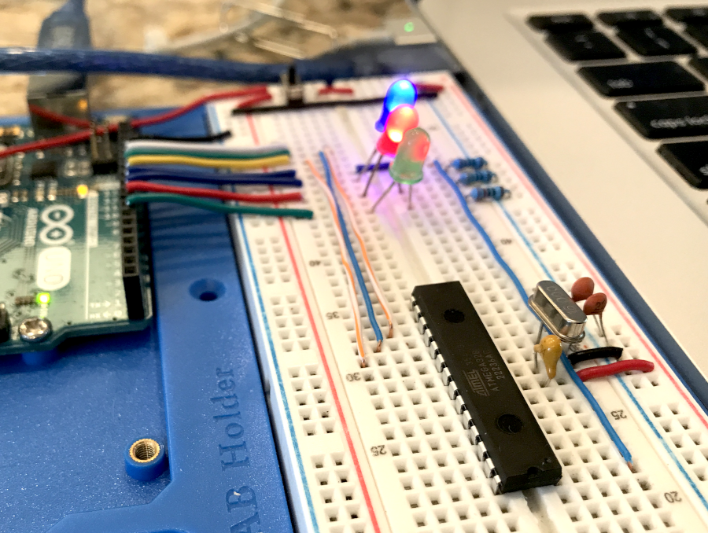
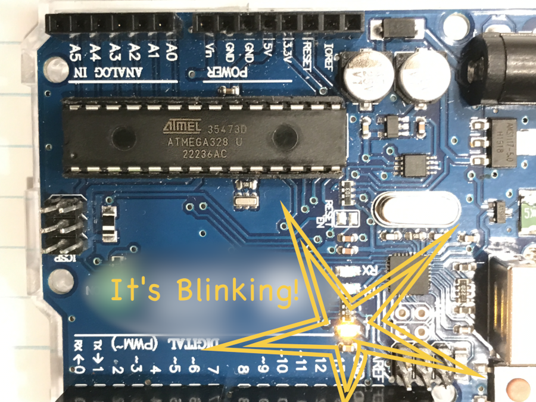

# Arduino Uno Using an ATmega328
A technique for replacing the ATmega328P controller on an Arduino Uno with the older, almost identical ATmega328 model.

My main purpose here is to record this information in the cloud where I can find it later. If a reader were to find anything useful in it, even better! But seriously: who in their right mind would have any good reason to do what I am about to describe here?

### Problem
You want to operate an Arduino Uno (Rev 3 or earlier) using an ATmega328 in place of the ATmega328P variant of the microcontroller for which it was designed. Also, you want to upload programs to it from the Arduino IDE.

I can think of three scenarios where this need could arise.

1. The ATmega328P on one of your Arduinos stops working and you have only 328s on hand for replacements.

2. You want to mount 328s onto an Arduino for convenient uploading of programs, in the same way that you would for a '328P.

3. You're just curious. Or maybe you know somebody who bought a Big Box 'O '328s by mistake and wants to find a use for them. (Now, who would do a thing like *that*? he wondered, as he turned his mirrors toward the wall.)

### Solution
Configure the '328 in such a way that it will appear to be a '328P for the purpose of uploading code. Do this first, before mounting the '328 into the Arduino.

The steps include:

* write the fuse bytes specified for operating a '328P on an Arduino Uno. The values to use can be found in the boards.txt file.

* upload the Optiboot bootloader into the flash memory.

A '328 thus prepared and inserted into the socket of an Uno will be seen by the Arduino IDE as a '328P. No practical difference between the two variants affects writing code. Each of the two variants can execute the same CPU instructions equally well as the other. [Footnote #1](#footnote-1).

### Equipment
This article demonstrates using the *avrdude* utility and a dedicated ISP programmer.

A second Arduino can be used as the ISP programmer. Many tutorials can be found online showing how to prepare and to deploy such a thing. I more or less followed the one provided by Arduino.cc: [https://docs.arduino.cc/built-in-examples/arduino-isp/ArduinoISP/](https://docs.arduino.cc/built-in-examples/arduino-isp/ArduinoISP/).

Figure 1 is a photo of the rig I put together. That's a '328 in the hot spot, about to receive instructions.


<br>**Figure 1: ATmega328 with Arduino-as-ISP programmer**

The examples here use a version of avrdude and its necessary resource file, avrdude.conf, that came installed with the Arduino IDE. I cobbled these scripts together based on tutorials found scattered around the web.

So soon old, so late smart, and now I know that complete, authoritative information is available at the Github repository: [https://github.com/avrdudes/avrdude](https://github.com/avrdudes/avrdude). The latest version of avrdude can be downloaded directly from there, and stored wherever you choose on your own computer.

Locate avrdude and avrdude.conf on the local computer. Make note of the full path that leads to each of those two files.

### Procedure
I connect the programmer directly to the SPI and reset pins of an unmounted '328 microcontroller. Those can be located by referring to the official datasheet. 

Attach the Arduino-as-ISP programmer to a USB port on the local computer. Make note of the "port" associated with the device. On a Windows machine, look in the Device Manager. On Linux or a Mac, look in the /dev directory.

Open a command line (terminal) window on the computer. Enter the avrdude commands that follow below, one at a time. 

The commands will be mostly the same, differing only at the end. They share a common structure, the examples given here conforming to my Mac.  Change the avrdude path, the avrdude.conf path and the port location to those of your particular setup.

| Option Code | Command or parameter string | Purpose |
| ----------- | ------------- | ------- |
|  | /Users/myname/Library/Arduino15/packages/arduino/tools/avrdude/6.3.0-arduino17/bin/avrdude | Invoke the avrdude utility |
| &#8209;C | /Users/myname/Library/Arduino15/packages/arduino/tools/avrdude/6.3.0-arduino17/etc/avrdude.conf  | Give location of avrdude configuration file |
| &#8209;v | | Elect verbose output |
| &#8209;p | m328 | Specify ATmega328 as the part to be programmed |
| &#8209;c | stk500v1 | Identify the type of programmer being used |
| &#8209;P | /dev/cu.usbmodem14101 | Identify the USB port being used
| &#8209;b | 19200 | BAUD rate |
| &#8209;U | memory:op:filename[:format] | Details the desired memory operation, as described below. |

It runs together as a single statement, leaving no space between option codes and the strings that go with them. Omitting the &#8209;U option will return general information about the target device, thus:

<blockquote>
/Users/myname/Library/Arduino15/packages/arduino/tools/avrdude/6.3.0-arduino17/bin/avrdude &#8209;C/Users/myname/Library/Arduino15/packages/arduino/tools/avrdude/6.3.0-arduino17/etc/avrdude.conf &#8209;v &#8209;pm328 &#8209;cstk500v1 &#8209;P/dev/cu.usbmodem14101 &#8209;b19200
</blockquote>

If you want to copy-and-paste, please do so from the "scripts" text file rather than from this browser display. The reason is that I used an html entity for non-breaking hyphen in place of the regular hyphen character in these example strings, for correct visual formatting in a browser. The browser is likely also to wrap the text, the way humans like to see it, giving an illusion of embedded line breaks. Your terminal program wants real hyphens and no line breaks. The text file has the right stuff.

A successful result shows up in the command window looking something like this:

<blockquote><pre>
avrdude: Version 6.3-20190619
         Copyright (c) 2000-2005 Brian Dean, http://www.bdmicro.com/
         Copyright (c) 2007-2014 Joerg Wunsch


... and more lovely information, ending with ...

avrdude: Device signature = 0x1e9514 (probably m328)
avrdude: safemode: lfuse reads as 62
avrdude: safemode: hfuse reads as DE
avrdude: safemode: efuse reads as FF

avrdude: safemode: lfuse reads as 62
avrdude: safemode: hfuse reads as DE
avrdude: safemode: efuse reads as FF
avrdude: safemode: Fuses OK (E:FF, H:DE, L:62)

avrdude done.  Thank you.
</pre></blockquote>

Don't you adore that cheery "Thank you" from the avrdude utility? 

I hope you see something like that. It means you are in business.
 
By the way, the fuse values shown above are the defaults as the device ships from the factory. 

The *boards.txt* file in the Arduino Core specifies certain, different values for the fuses on a '328 or '328P running on an Arduino Uno. We shall need to write those values into the fuse memory. Caution, you can "brick" an AVR by getting a fuse byte wrong. Go slowly and pay attention.

Also, we are going to upload the bootloader that enables a microcontroller mounted on the Arduino to accept code uploads.

Write the "extended" fuse byte first. We just add the &#8209;U option, meaning to Upload, onto the end of the common command line given above, . 

The parameter string following the &#8209;U option in each of the following scripts contains four distinct fields separated by colons. These fields determine what changes avrdude will make inside the device, so proceed with care. The string for the extended fuse memory is "efuse:w:0xfd:m",

* **efuse** directs the action to the extended fuse memory space, 
* **w** tells avrdude to write what comes next into the specified memory, 
* **0xfd** is the value to be written, and 
* the **m** signifier tells avrdude to write the literal, 8-bit (one byte) value as given, 0xfd.

Writing the value 0xfd here will configure the Brown-Out Detector to reset the ATmega328 whenever the supply voltage falls much below 2.9 volts.

<blockquote>
/Users/myname/Library/Arduino15/packages/arduino/tools/avrdude/6.3.0-arduino17/bin/avrdude &#8209;C/Users/myname/Library/Arduino15/packages/arduino/tools/avrdude/6.3.0-arduino17/etc/avrdude.conf &#8209;v &#8209;pm328 &#8209;cstk500v1 &#8209;P/dev/cu.usbmodem14101 &#8209;b19200 &#8209;U efuse:w:0xfd:m
</blockquote>


If you do *not* want the Brown-Out Detector to trigger any resets on your ATmega328, then disable it by writing the extended fuse to 0xff instead. [Footnote #2](#footnote-2)

Next, write the "high" fuse byte.

<blockquote>
/Users/myname/Library/Arduino15/packages/arduino/tools/avrdude/6.3.0-arduino17/bin/avrdude &#8209;C/Users/myname/Library/Arduino15/packages/arduino/tools/avrdude/6.3.0-arduino17/etc/avrdude.conf &#8209;v &#8209;pm328 &#8209;cstk500v1 &#8209;P/dev/cu.usbmodem14101 &#8209;b19200 &#8209;U hfuse:w:0xde:m
</blockquote>

 
Now, at this point I would skip over writing the "low" fuse byte for the moment. Instead, upload the bootloader into the flash memory.

<blockquote>
/Users/myname/Library/Arduino15/packages/arduino/tools/avrdude/6.3.0-arduino17/bin/avrdude &#8209;C/Users/myname/Library/Arduino15/packages/arduino/tools/avrdude/6.3.0-arduino17/etc/avrdude.conf &#8209;v &#8209;pm328 &#8209;cstk500v1 &#8209;P/dev/cu.usbmodem14101 &#8209;b19200 &#8209;U flash:w:/Applications/Arduino.app/Contents/Java/hardware/arduino/avr/bootloaders/optiboot/optiboot_atmega328.hex:i
</blockquote>

The -U parameter string for the bootloader gives the filesystem path to where the compiled firmware resides on my Mac. You will have to find the actual path on your machine and replace mine with yours. Note that the signifier in this command is "i", to indicate the firmware file is in the "Intel Hex" format.

Finally, write the low fuse byte. This one changes the clock source for the chip to require a 16&nbsp;MHz external crystal. After you write this new value into the fuse and perform a power-on reset of the chip, it will need to be connected to such a crystal in order to communicate with avrdude. As Figure 1 shows, I included a 16&nbsp;MHz crystal in my homebuilt programmer also.

<blockquote>
/Users/myname/Library/Arduino15/packages/arduino/tools/avrdude/6.3.0-arduino17/bin/avrdude &#8209;C/Users/myname/Library/Arduino15/packages/arduino/tools/avrdude/6.3.0-arduino17/etc/avrdude.conf &#8209;v &#8209;pm328 &#8209;cstk500v1 &#8209;P/dev/cu.usbmodem14101 &#8209;b19200 &#8209;U lfuse:w:0xff:m
</blockquote>

If all goes well you will see messages indicating success at each step. Now you can install the ATmega328 onto the Arduino Uno.

### The Signature Bytes
Avrdude will report the signature bytes it finds inside the controller, like this:

<blockquote>
avrdude: Device signature = 0x1e9514 (probably m328)
</blockquote>

We cannot change those bytes. Meanwhile, an ATmega328P returns a different signature. Arduino IDE uses avrdude to upload code into the chip mounted on the board. It tells avrdude to expect to see the '328P signature. Normally, avrdude will abort an upload if it finds a device signature different from what it expects. So why does it not complain about the signature bytes when you upload code into a properly configured '328 installed into the socket on an Arduino Uno?

Tom Almy, the electrical engineer and author of the excellent series of "Far Inside Arduino" books, found the answer in the source code for the bootloader. Avrdude does not inspect the physical chip mounted on the Arduino board. Instead, it asks the bootloader, *which always returns the signature bytes for a '328P*. 

It's a trick by those bootloader-code-writin' rascals to get an Uno to work with a non-Pico '328. As the two variants are so nearly alike, this workaround appears largely useful and fairly benign. I am glad to partake of it. Just keep in mind the difference involving the Brown-Out Detector. [Footnote #2](#footnote-2).

It means you can write just about any Arduino Uno code and then upload it to the '328 mounted on the board by simply clicking the "Upload" arrow icon, or from the menu bar with Sketch > upload. And here is the Blink example program, uploaded that way and blinking away! 


<br>**An ATmega328, not-P, running the Blink demo program in an Arduino Uno clone board**

 
 
<h4 id="footnote-1">Footnote #1</h4>

The "P" in 328P denotes a PicoPower version of the microcontroller. It consumes less current compared to the '328 without the "P".  The difference is not really noticeable on an Uno operating on 5 volts at a clock speed of 16 MHz.

Detail-minded readers of the official datasheet for the devices can still find it mentioned that the '328, without the "P", lacks the ```jmp``` and ```call``` assembly language instructions. That is obsolete information.

Since revision of the silicon to the modern AVRe+ core, 328 chips do in fact support those instructions, according to the megaAVR device table in the [AVR Instruction Set Manual - 2021 edition](https://ww1.microchip.com/downloads/en/DeviceDoc/AVR-InstructionSet-Manual-DS40002198.pdf) as that link was accessed in May 2024.

<h4 id="footnote-2">Footnote #2</h4>

ATmega328P chips enable software to turn the Brown-Out Detector (BOD) on and off during runtime. The plain '328s do not. That is why the decision whether to operate the BOD in a '328 needs to be implemented in the extended fuse byte. 

Readers take note: I have not investigated what might happen by telling a '328 to turn off its BOD. The need to manage the BOD dynamically has just never come up for me. If you need that capability, a '328 would be the wrong part; use a '328P instead.

